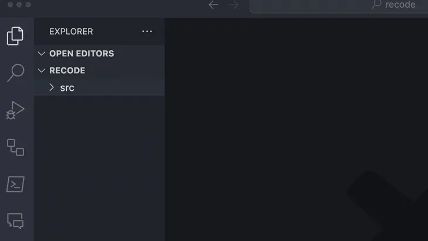

# Copy as Code Block for VSCode



This VSCode extension allows you to copy selected text in the editor as a code block to the clipboard.

The selected text will be wrapped in a code block with a relative path to the file in the workspace.

This is useful for pasting code blocks when creating prompts for AI.

The shortcut key is `⌘+Shift+C` (or, `Cmd+Shift+C`).

## Main Features

- Retrieve text selected in the editor.
- Wrap the text in a code block with its relative path to the workspace file.
- Copy the wrapped text to the clipboard.

## Installation

1. Open Visual Studio Code.
2. Open the extensions view.
3. Search for "Copy as Code Block" and install.
4. Reload to activate the extension.

## How to Use

1. Select text inside the editor.
2. Press `⌘+Shift+C` (or, `Cmd+Shift+C`).
3. Paste anywhere, and the selected text will be pasted as a code block.

## Example

After copying, pasting the text will look like this:

```````
```src/sample.ts
console.log("Hello World!");
```
```````

このVSCode拡張機能は、エディタで選択したテキストをコードブロックとしてクリップボードにコピーするためのものです。

選択したテキストは、ワークスペース内のファイルの相対パスを持つコードブロックでラップされます。

生成AI用のプロンプトを作成する際に、コードブロックを貼り付けるのに便利です。

ショートカットキーは、`⌘+Shift+C` (または、`Cmd+Shift+C`)です。

## 主な機能

- エディタで選択したテキストを取得
- テキストを、そのファイルのワークスペースに対する相対パスを持つコードブロックでラップ
- ラップされたテキストをクリップボードにコピー

## インストール方法

1. Visual Studio Codeを開く
2. 拡張機能ビューを開く
3. "Copy as Code Block"を検索し、インストールする
4. 再読み込みして拡張機能をアクティベートする

## 使い方

1. エディタ内でテキストを選択する
2. `⌘+Shift+C` (または、`Cmd+Shift+C`)を押す
3. 任意の場所にペーストすることで、選択したテキストがコードブロックとして貼り付けられる

## 例

コピーした後、テキストを貼り付けると、以下のようになります。

```````
```src/sample.ts
console.log("Hello World!");
```
```````

## ライセンス

MIT
